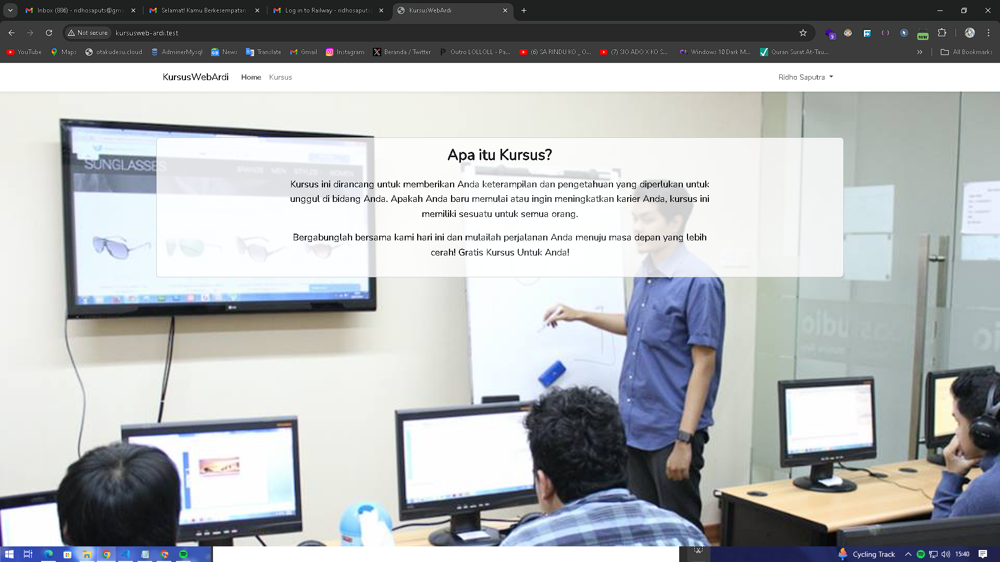
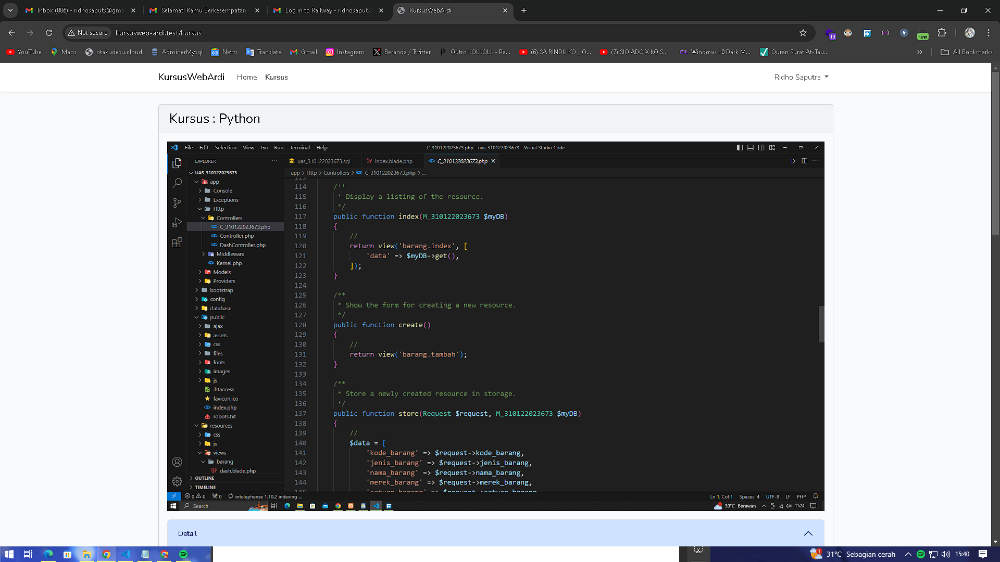
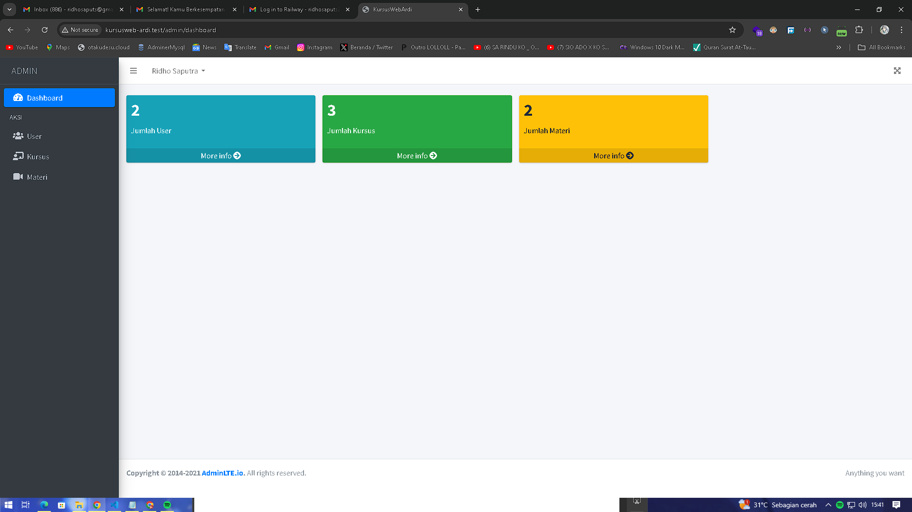
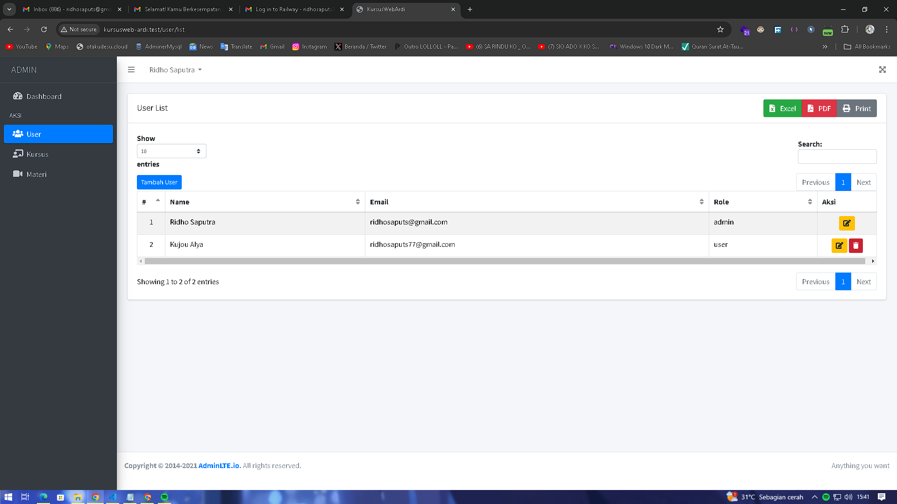
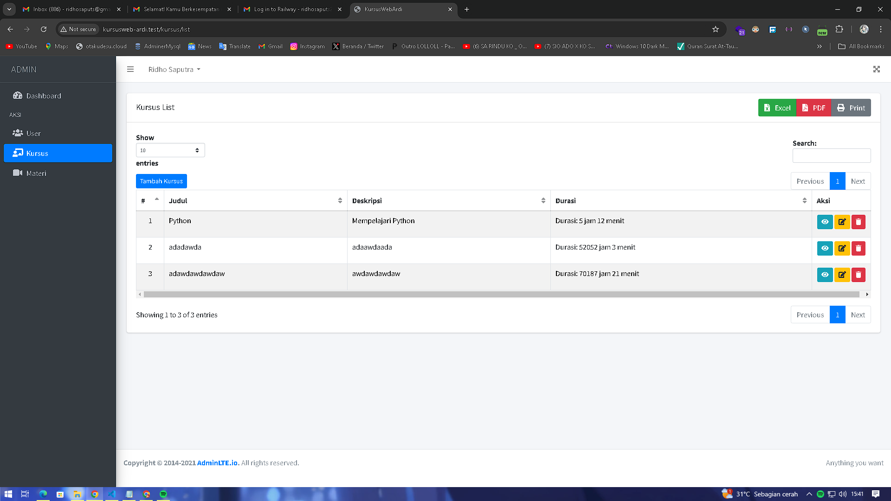
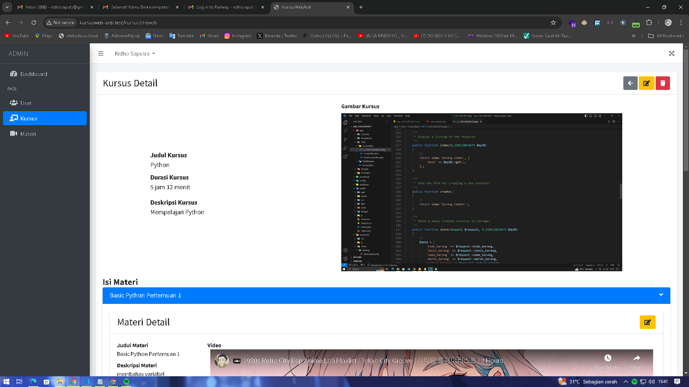
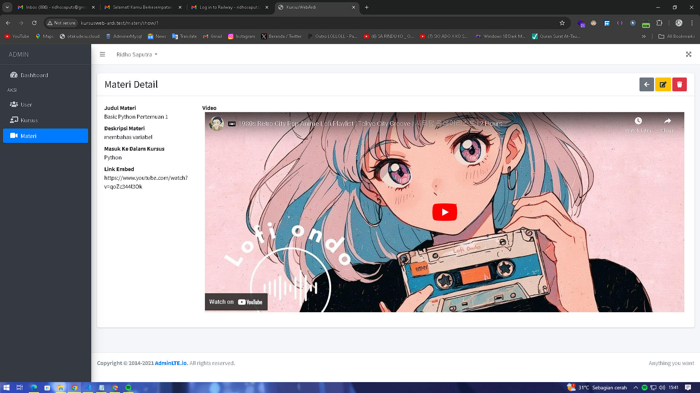
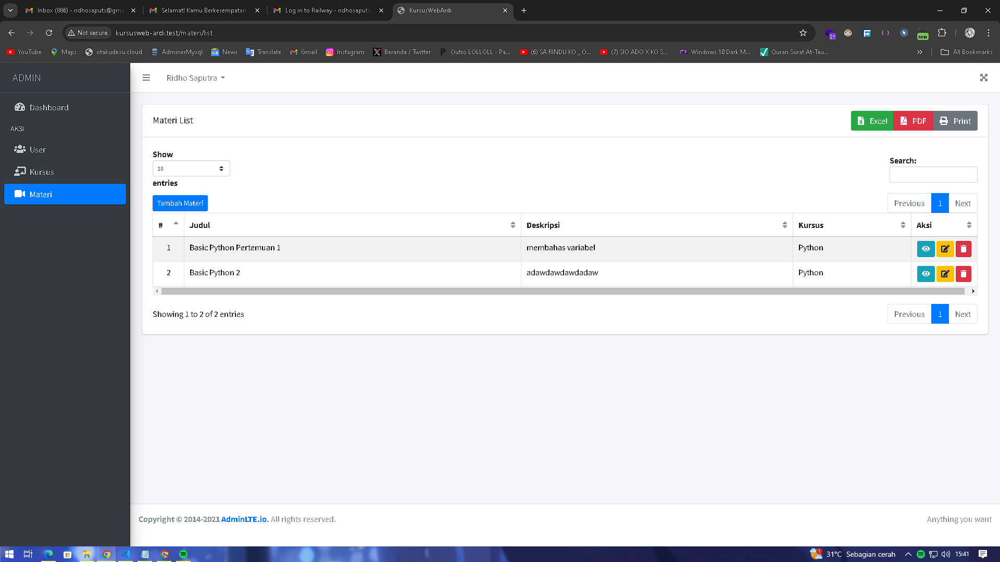

# Kursus Web Ardi

## Daftar Isi

-   [Instalasi](#instalasi)
-   [Cara Penggunaan](#cara-penggunaan)


<br>

<br>

<br>

<br>

<br>

<br>

<br>


## Instalasi

Berikut adalah langkah-langkah untuk menginstal dan menjalankan proyek ini:

1. Clone repositori ini ke direktori lokal Anda:

    ```bash
    git clone https://github.com/r1dhosaputs/kursusweb-ardi.git
    ```

2. Masuk ke direktori proyek:

    ```bash
    cd repo-name
    ```

3. Install dependencies PHP menggunakan Composer:

    ```bash
    composer install
    ```

4. Install dependencies frontend menggunakan npm:

    ```bash
    npm install
    npm run build
    ```

5. Salin file `.env.example` menjadi `.env`:

    ```bash
    cp .env.example .env
    ```

6. Generate application key:

    ```bash
    php artisan key:generate
    ```

7. Setel database di file `.env` sesuai dengan konfigurasi lokal Anda, kemudian jalankan migrasi dan seeder:

    ```bash
    php artisan migrate --seed
    ```

8. Jalankan server lokal:

    ```bash
    php artisan serve
    ```

9. Akses aplikasi di [http://localhost:8000](http://localhost:8000).

## Cara Penggunaan

- Pastikan Seeder Sudah Run Lalu Berhasil
- Untuk Melakukan Login Admin pada /login, email : ridhosaputs2nd@gmail.com dan password adalah admin
- Untuk Melakukan Login User Biasa pada /login, email : ridhosaputs77@gmail.com dan password adalah user
